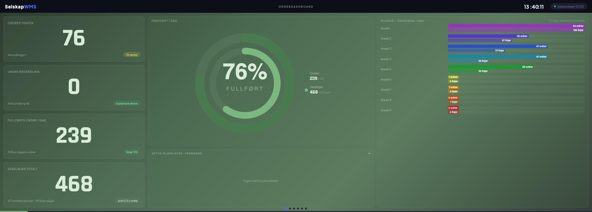
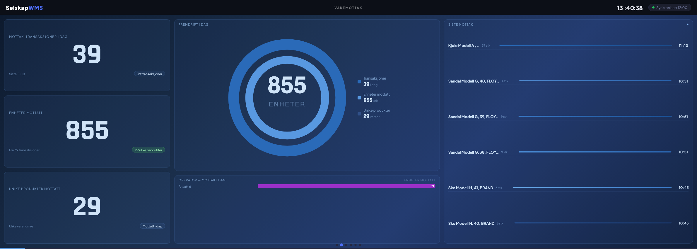
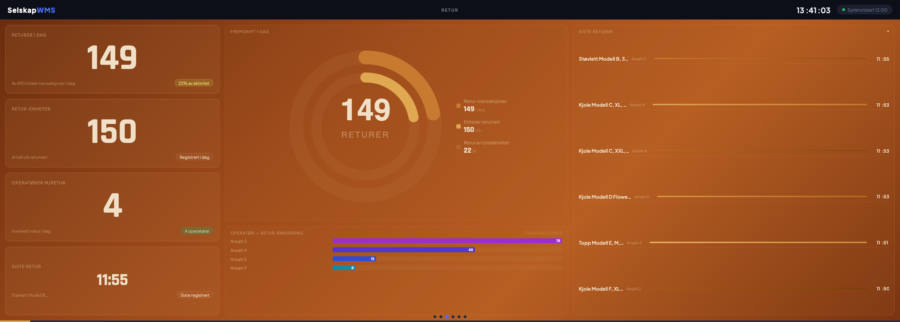
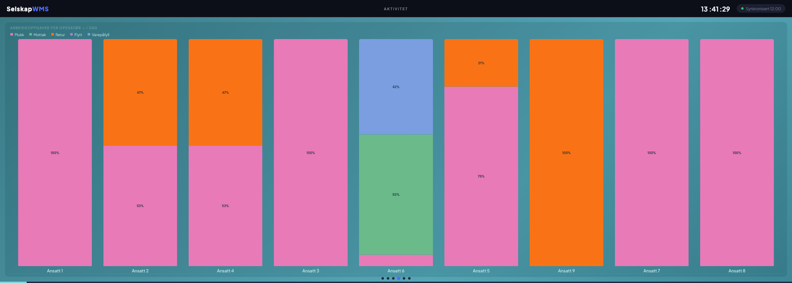
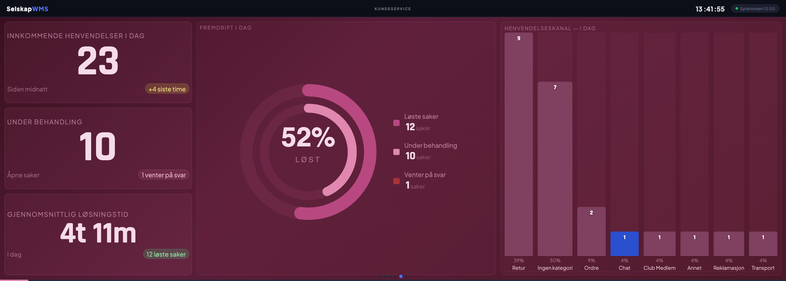
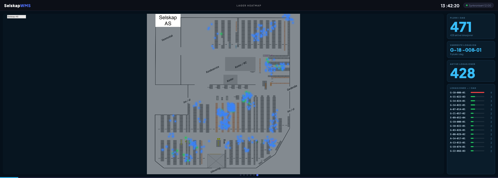

# Instock WMS Dashboard

A standard dashboard for the Instock WMS platform (Azure SQL).
Displays warehouse activity on screens around the warehouse — auto-refreshes every 5 minutes.








---

## Architecture

```
Azure SQL (Instock WMS)
       │
       │  GitHub Actions cron (every 30 min)
       ▼
  sync/index.js  ──────────────►  Supabase
                                      │
                                      │  Supabase anon key (read-only)
                                      ▼
                               dashboard/index.html  ──►  Vercel (static)
```

**Local development only:** `wms-api/` serves the dashboard directly from Express, reading live from Azure SQL. No sync needed.

---

## New customer deployment — 5 steps

### 1. Supabase — create tables
Run `supabase/schema.sql` in the Supabase SQL Editor.

### 2. GitHub Secrets — add credentials
In your GitHub repo → Settings → Secrets and variables → Actions, add:

| Secret | Value |
|--------|-------|
| `DB_SERVER` | Azure SQL server hostname |
| `DB_PORT` | `3342` |
| `DB_NAME` | Database name |
| `DB_USER` | SQL username |
| `DB_PASSWORD` | SQL password |
| `SUPABASE_URL` | `https://xxx.supabase.co` |
| `SUPABASE_SERVICE_KEY` | Service role key (from Supabase → Settings → API) |
| `CUSTOMER_NAME` | `Kundenavn AS` |
| `CUSTOMER_SHORT` | `KUNDE` |
| `CUSTOMER_COLOR` | `#4f6ef7` |
| `WAREHOUSE_ID` | *(empty = all warehouses)* |
| `ZONES_JSON` | See `sync/.env.example` for format |
| `COLD_STATUS_IDS` | `2,6,9,12` |
| `SYSTEM_LOCATIONS` | `MOTTAK,Bermuda,REKLAMASJON,...` |

### 3. Dashboard config
```bash
cp dashboard/config.example.js dashboard/config.js
# Fill in SUPABASE_URL and SUPABASE_ANON_KEY (public/anon key, not service key)
```

### 4. Vercel — deploy
- Connect GitHub repo to Vercel
- Set **Root Directory** to `dashboard`
- No build command needed — it's static HTML

### 5. Trigger first sync
In GitHub → Actions → "Sync WMS Data" → Run workflow.

---

## Local development

```bash
cd wms-api

cp .env.example .env
# Fill in DB_NAME and DB_PASSWORD

cp src/customer.config.example.js src/customer.config.js
# Edit with customer zones and settings

npm install
npm run dev
```

Open **http://localhost:3001** in the browser.

> `customer.config.js` and `.env` are gitignored — never committed.

---

## Project structure

```
/
├── .github/workflows/
│   ├── sync.yml              ← GitHub Actions cron (every 30 min)
│   └── weekly-slotting-report.yml  ← Weekly email report (Wednesdays)
│
├── dashboard/
│   ├── index.html            ← Static dashboard (reads Supabase)
│   ├── config.js             ← GITIGNORED — Supabase anon key
│   └── config.example.js     ← Template
│
├── wms-api/            ← Local dev only (not deployed)
│   ├── src/
│   │   ├── server.js
│   │   ├── db.js
│   │   ├── customer.config.js       ← GITIGNORED
│   │   ├── customer.config.example.js
│   │   └── routes/
│   └── wms-dashboard-v2.html
│
├── supabase/
│   └── schema.sql            ← Run once in Supabase SQL Editor
│
├── sync/
│   ├── index.js              ← Sync script: Azure SQL → Supabase
│   ├── package.json
│   └── .env.example          ← Template (sync/.env is gitignored)
│
├── reports/
│   ├── weekly-slotting.js    ← Weekly slotting report (GitHub Actions, reads Supabase)
│   ├── package.json
│   └── .env.example          ← Template (reports/.env is gitignored)
│
└── vercel.json               ← Points Vercel to dashboard/ directory
```

---

## Weekly slotting report

An optional automated email report sent every Wednesday via GitHub Actions.

It reads zone and product data from Supabase and sends an HTML email with:
- ABC classification of products (A = 80% of picks, B = 15%, C = rest)
- Hot zone placement analysis — are your A-items actually in the hot zones?
- Move candidates — products with inactive status (EOL, seasonal, etc.) still in hot zones
- Zone pick activity summary for the past 7 days

### Setup

#### 1. Azure App Registration

You need an Azure App Registration with **Mail.Send** (Application permission) to send emails via Microsoft Graph.

1. [Azure Portal](https://portal.azure.com) → Entra ID → App registrations → New registration
2. Certificates & secrets → New client secret — copy the value immediately
3. API permissions → Add → Microsoft Graph → Application permissions → `Mail.Send` → Grant admin consent
4. Note down: Tenant ID, Client ID, Client Secret

#### 2. GitHub Secrets — add to the repo

In GitHub repo → Settings → Secrets and variables → Actions, add:

| Secret | Value |
|--------|-------|
| `SUPABASE_URL` | Your Supabase project URL |
| `SUPABASE_SERVICE_KEY` | Service role key (from Supabase → Settings → API) |
| `AZURE_TENANT_ID` | Azure AD tenant ID |
| `AZURE_CLIENT_ID` | App registration client ID |
| `AZURE_CLIENT_SECRET` | App registration client secret |
| `REPORT_FROM_EMAIL` | Licensed mailbox to send from (e.g. `noreply@yourcompany.com`) |
| `REPORT_TO_EMAIL` | Recipient(s) — separate multiple with semicolon |

#### 3. Schedule

The workflow runs every **Wednesday at 12:00 Oslo time** (CET/CEST aware).
You can also trigger it manually from GitHub Actions → "Weekly Slotting Report" → Run workflow.

#### 4. Local testing

```bash
cd reports
cp .env.example .env
# Fill in all values
npm install
node weekly-slotting.js
```

---

## API endpoints (local dev only)

| Method | URL | Description |
|--------|-----|-------------|
| GET | `/api/config` | Customer config (zones, colors, name) |
| GET | `/api/health` | Health check |
| GET | `/api/zones` | Pick activity per zone |
| GET | `/api/zones/hotzone` | Top-N products by pick frequency |
| GET | `/api/zones/move-suggest` | Move candidates in hot zone |
| GET | `/api/zones/stock` | Stock per location |
| GET | `/api/orders` | Orders and pipeline counts |
| GET | `/api/orders/picklist/:id` | Picklist lines for one operator |
| GET | `/api/operators` | All operators with transaction breakdown |
| GET | `/api/operators/:id` | Historical breakdown for one operator |
| GET | `/api/inbound` | Incoming deliveries |
| GET | `/api/inbound/mottak` | Goods received |
| GET | `/api/inbound/flow` | Internal zone moves |
| GET | `/api/inbound/history` | Transaction history |
